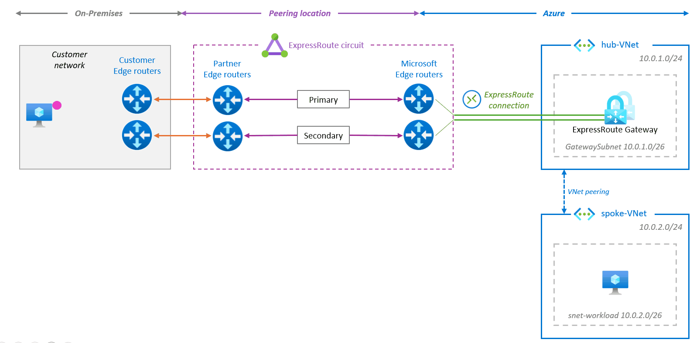
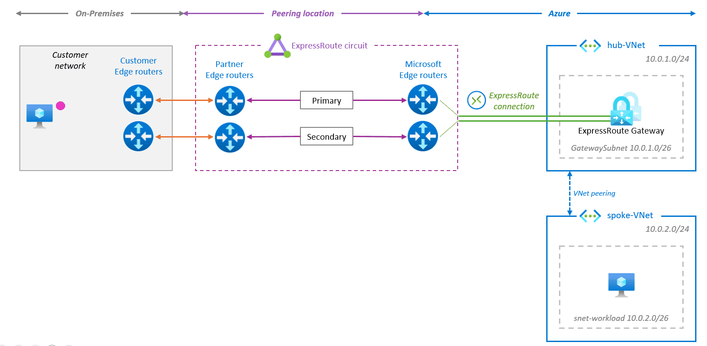

# ExpressRoute datapath, FastPath and FastPath IP limits 

## Default behavior

The data flow between On-Prem and Azure using ExpressRoute is asymmetric by design. 

Traffic from On-Prem to Azure transits via the ExpressRoute Gateway but the return traffic (Azure to On-Prem) bypasses the ExpressRoute Gateway and is forwarded directly to the MSEEs.

If multiple ExpressRoute Circuits are advertising copies of the same On-Prem routes and are connected to the same ExpressRoute Gateway, Azure to On-Prem traffic is ECMPed across the different ExpressRoute Circuits available unless traffic engineering is configured to prioritise 1 path over the others.

## With ExpressRoute FastPath

Enabling the [ExpressRoute FastPath](https://learn.microsoft.com/en-us/azure/expressroute/about-fastpath) feature allows On-Prem to Azure traffic to bypass the ExpressRoute Gateway as well, leading to improved data path performances: 

This results in reduced latency and the ability to exceed the ExpressRoute Gateway maximum throughput limit of 10 Gbps.

Current constraints and limitations:
- **Available only on Ultra Performance or ErGw3AZ**
- [IP address limit*](https://learn.microsoft.com/en-us/azure/expressroute/about-fastpath#ip-address-limits)
- Limited support of Private Link for ExpressRoute Direct circuits only, not supported at all on ExpresRoute partner circuits
- FastPath support for [UDRs](https://learn.microsoft.com/en-us/azure/expressroute/about-fastpath#user-defined-routes-udrs) on the Gateway subnet and for [VNet peering](https://learn.microsoft.com/en-us/azure/expressroute/about-fastpath#virtual-network-vnet-peering) is still in preview and available for ExpressDirect circuits only

## *About the FastPath IP address limit

In our documentation, we specify the following limits for the number of **FastPath IPs**: 

| **ExpressRoute SKU** | **Bandwidth** | **FastPath IP limit** |
|-|-|-|
| ExpressRoute Direct | 100 Gbps | **200k** |
| ExpressRoute Direct | 10 Gbps | **100k** |
|ExpressRoute provider circuit | =< 10 Gbps| **25k** |

When FastPath is enabled, this limit is the maximum number of Azure endpoints in the VNet environment that will be configured to bypass the ExpressRoute Gateway. Whenever a new IP address is added or removed, the FastPath IPs are automatically reprogrammed to reflect that change, keeping the FastPath IP list up to date.

> It is important to note that when calculating the limit for FastPath IPs, only endpoints with assigned private IP addresses within a subnet or VNet range are counted. The entire address range won't be included in the calculation of consumed IPs.

Azure Monitor offers metrics for ExpressRoute Direct resources, which includes the ability to track the number of [configured FastPath routes](https://learn.microsoft.com/en-us/azure/expressroute/expressroute-monitoring-metrics-alerts#fastpath-routes-count-at-port-level) at the port level.
